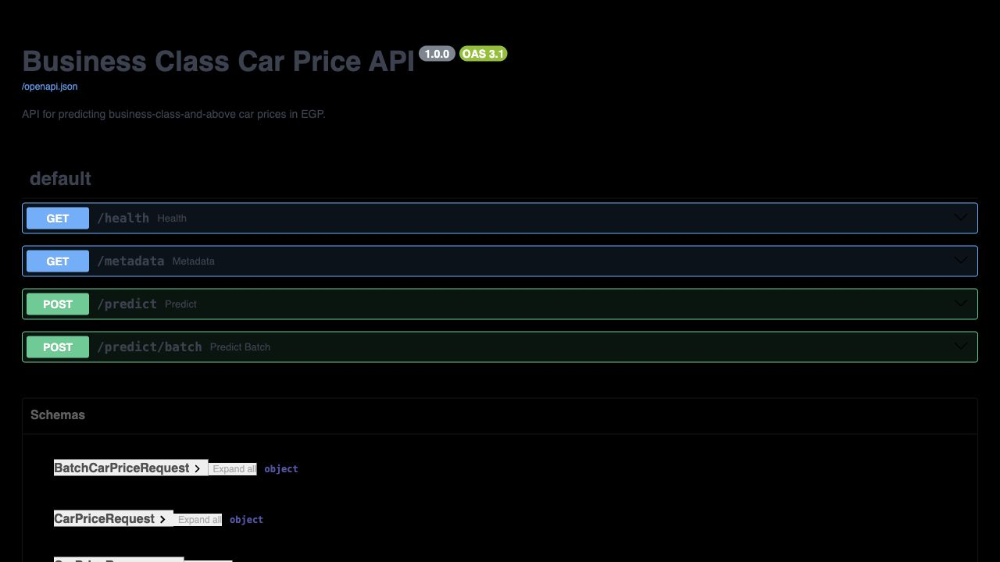
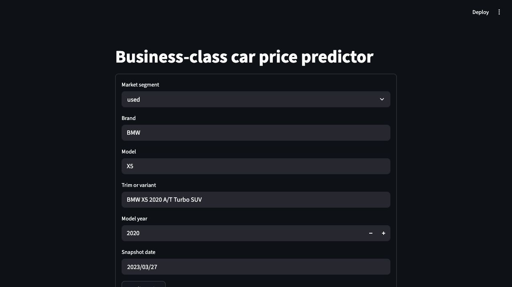

# Федеральное государственное автономное образовательное учреждение высшего образования "Национальный исследовательский университет Высшая школа экономики"

Московский институт электроники и математики им. А. Н. Тихонова НИУ ВШЭ

Департамент компьютерной инженерии

**Отчёт по проекту CP3 по дисциплине**

**«Проектный семинар «Основы технологии производства и машинное обучение»»**

**Группа:** БИВ232

**Выполнил:** Гилядов Борис Равашиевич

<!-- pagebreak -->

# Отчет по проекту: CP3

---

## 1. Введение и постановка задачи

- **Цель проекта:** предсказать рыночную цену автомобиля в сегменте `business class and above` по характеристикам автомобиля и времени публикации цены.
- **Формулировка задачи:** регрессия.
- **Определение сегмента:** сегмент задается воспроизводимым price-based правилом `target_price >= 350000 EGP`.
- **Практическая ценность:** модель может использоваться как быстрый ориентир для первичной оценки стоимости автомобиля в верхнем ценовом сегменте.
- **Основная метрика:** `MAE`, потому что она интерпретируется как средняя абсолютная ошибка в деньгах и менее чувствительна к редким очень дорогим автомобилям, чем `RMSE`.
- **Дополнительные метрики:** `RMSE`, `R2`.

---

## 2. Поиск и описание данных

- **Источник данных:** Kaggle, датасет [Car Prices Market](https://www.kaggle.com/datasets/muhammedzidan/car-prices-market).
- **Причина выбора:** в датасете есть цены для `new` и `used` автомобилей, текстовое описание автомобиля и временная метка, поэтому можно обучать модель и делать хронологический split без утечки будущих наблюдений.
- **Исходный объем:**
  - `used`: `78612` строк
  - `new`: `3433` строки
  - всего: `82045` строк
- **Итоговый объем после отбора сегмента:** `11107` строк.
- **Итоговые характеристики выборки:**
  - брендов: `54`
  - уникальных моделей: `1207`
  - диапазон модельных лет: `2003-2023`
  - период наблюдений: `2014-08-01` - `2023-03-27`
- **Ограничение данных:** сегмент определяется через цену, а не через официальную классификацию брендов, поэтому в выборку попадают как премиальные бренды, так и дорогие комплектации массовых брендов.

---

## 3. Обработка и подготовка данных

- Названия колонок нормализованы к единому формату.
- Строковые цены переведены в числовой формат.
- `Price Change` преобразован в signed numeric value.
- Даты приведены к `datetime`.
- Из `Car Model` извлечены `brand`, `model_year` и текстовая часть модели.
- Строки без цен удалены.
- Жесткое удаление верхнего хвоста не применялось, так как дорогие автомобили являются частью целевого сегмента.

**Feature engineering:**

- `snapshot_year`, `snapshot_month`
- `vehicle_age`
- `variant_token_count`, `variant_char_length`
- `brand_name_length`, `model_name_length`
- `is_new_listing`
- бинарные признаки по словам в `trim_or_variant`: `automatic`, `manual`, `turbo`, `coupe`, `suv`, `hybrid`, `electric`, `cabrio`, `hatchback`

**Количество признаков для моделирования:** `22`.

**EDA-наблюдения:**

- медианная цена: `514000 EGP`
- 90-й перцентиль цены: `990000 EGP`
- в итоговой выборке `8301` строк из `used` и `2806` строк из `new`

**Split данных:**

- стратегия: хронологический split по `snapshot_date`
- `train`: `7160` строк, `2014-08-01` - `2022-09-06`
- `val`: `1915` строк, `2022-09-08` - `2022-12-18`
- `test`: `2032` строки, `2022-12-19` - `2023-03-27`

---

## 4. Baseline-модель

- **Baseline:** `LinearRegression` с `OneHotEncoder` для категориальных признаков.
- **Нижняя граница:** `DummyRegressor(strategy="median")`.
- **Результат baseline на test:**
  - `MAE = 289671.40`
  - `RMSE = 449685.54`
  - `R2 = 0.4943`

Baseline показывает, что бренд, модель, возраст автомобиля и временные признаки уже дают полезный сигнал для оценки цены.

---

## 5. Эксперименты

**Эксперимент 1. LinearRegression.**
**Гипотеза:** простая линейная модель сможет использовать бренд, модель и возраст автомобиля как сильные признаки цены.
**Как проверялось:** `LinearRegression` с `OneHotEncoder` для категориальных признаков и стандартизацией числовых признаков.
**Результат:** модель дала лучший `Test MAE = 289671.40`, но не лучший `Val MAE`, поэтому используется как сильный baseline.

**Эксперимент 2. Ridge.**
**Гипотеза:** регуляризация снизит переобучение линейной модели на большом числе one-hot признаков.
**Как проверялось:** `Ridge(alpha=10.0)` с тем же препроцессингом, что и у линейной регрессии.
**Результат:** качество стало ниже: `Test MAE = 299673.30`, поэтому регуляризация в такой конфигурации не улучшила модель.

**Эксперимент 3. RandomForestRegressor.**
**Гипотеза:** ансамбль деревьев лучше поймает нелинейные зависимости между брендом, возрастом, типом объявления и ценой.
**Как проверялось:** `RandomForestRegressor` с ordinal encoding категориальных признаков.
**Результат:** модель показала сильное качество (`Val MAE = 177057.95`, `Test MAE = 291184.35`), но немного уступила линейной регрессии на test.

**Эксперимент 4. HistGradientBoostingRegressor.**
**Гипотеза:** градиентный бустинг даст лучшую ошибку на валидации за счет последовательного исправления ошибок деревьев.
**Как проверялось:** `HistGradientBoostingRegressor` с тем же tree-preprocessing, что и RandomForest.
**Результат:** модель дала лучший `Val MAE = 172821.99`, поэтому выбрана финальной для деплоя, хотя на test виден риск временного сдвига (`Test MAE = 354368.96`).

| Модель | Val MAE | Test MAE | Test RMSE | Test R2 | Комментарий |
|--------|---------|----------|-----------|---------|-------------|
| HistGradientBoostingRegressor | 172821.99 | 354368.96 | 583415.68 | 0.1488 | лучшая валидация |
| RandomForestRegressor | 177057.95 | 291184.35 | 495961.01 | 0.3849 | сильная нелинейная модель |
| LinearRegression | 204111.93 | 289671.40 | 449685.54 | 0.4943 | лучший test MAE |
| Ridge | 222610.47 | 299673.30 | 520521.87 | 0.3224 | регуляризация не улучшила качество |
| DummyRegressor | 311676.60 | 337904.99 | 695838.28 | -0.2108 | нижняя граница |

**Вывод по экспериментам:** по валидационной `MAE` лучшей моделью стала `HistGradientBoostingRegressor`, поэтому именно она сохранена как `models/best_model.joblib` и используется в сервисе. При этом `LinearRegression` дала лучший `test MAE`, что показывает риск переобучения/нестабильности более сложных моделей на временном сдвиге.

---

## 6. Финальная модель и интерпретируемость

Финальная модель для деплоя: `HistGradientBoostingRegressor`.

**Почему выбрана она:**

- основная метрика проекта - `MAE`;
- выбор финальной модели сделан по минимальной `Val MAE`;
- модель работает с тем же feature engineering, что и эксперименты;
- артефакт модели сохранен и загружается API без повторного обучения.

**Интерпретация поведения модели:**

- цена сильно зависит от бренда и модели;
- новые автомобили и свежие модельные годы получают отдельный сигнал через `is_new_listing`, `model_year`, `vehicle_age`;
- текстовые признаки комплектации помогают частично учитывать тип кузова и технологические слова вроде `turbo`, `hybrid`, `electric`.

---

## 7. Деплой

Для CP3 реализован локальный деплой в формате API + пользовательский интерфейс.

**Компоненты:**

- `src/api.py` - FastAPI-приложение;
- `src/prediction.py` - загрузка модели и подготовка признаков для инференса;
- `src/ui.py` - Streamlit-интерфейс;
- `Dockerfile` - контейнер для API/интерфейса;
- `docker-compose.yml` - совместный запуск API и UI.

**API endpoints:**

- `GET /health` - проверка, что сервис поднят и модель загружена;
- `GET /metadata` - информация о модели, метрике, признаках и split;
- `POST /predict` - одиночное предсказание;
- `POST /predict/batch` - batch-предсказание до 100 объектов.

**Пример запроса:**

```bash
curl -X POST http://127.0.0.1:8000/predict \
  -H "Content-Type: application/json" \
  -d '{
    "dataset_part": "used",
    "brand": "BMW",
    "model": "X5",
    "trim_or_variant": "BMW X5 2020 A/T Turbo SUV",
    "model_year": 2020,
    "snapshot_date": "2023-03-27"
  }'
```

**Пример ответа:**

```json
{
  "predicted_price_egp": 464149.38,
  "model_name": "hist_gradient_boosting",
  "primary_metric": "mae"
}
```

**Запуск локально:**

```bash
docker compose up --build
```

После запуска:

- API: `http://127.0.0.1:8000`
- Swagger UI: `http://127.0.0.1:8000/docs`
- Streamlit UI: `http://127.0.0.1:8501`

**Скриншоты работы:**





**Ссылка на видео демонстрации:** [Google Drive](https://drive.google.com/file/d/1j6cHm-7jLGgWHgKoffkvEDJk2mHOZglV/view?usp=sharing).

В видео показана работа деплоя: запуск сервиса, запрос к API и предсказание через интерфейс.

---

## 8. Заключение и выводы

На CP3 проект доведен до воспроизводимого сервиса:

- собран и очищен датасет для сегмента `business class and above`;
- проведены EDA и feature engineering;
- обучены baseline и экспериментальные модели;
- сохранен модельный артефакт для инференса;
- реализован FastAPI деплой;
- реализован Streamlit-интерфейс;
- добавлены Docker-инструкции и docker-compose запуск.

Главное ограничение модели сохраняется: сегмент задается ценовым порогом, а не официальной бизнес-классификацией автомобилей. Дополнительное улучшение на следующих итерациях - стабильнее выбрать финальную модель по временной валидации и добавить более богатые признаки по техническим характеристикам автомобиля.
